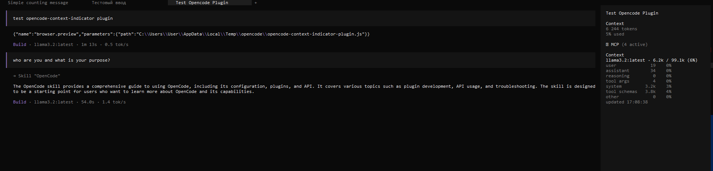

# opencode-context-indicator

Real-time **context-window usage** indicator for [OpenCode](https://opencode.ai),
with a **per-category token breakdown** and an optional **terminal-UI sidebar**.

It tells you how full the current model's context window is, and *what* is
filling it: system prompt, tool schemas, user/assistant text, reasoning, tool
arguments and the residual "other" bucket.

The package ships a **dual V1 + V2 plugin** (one entry works in both OpenCode
generations) plus an optional TUI sidebar module exposed as the `./tui` entry.



---

## What it shows

### Per-category breakdown

For every served request the plugin estimates how the context window is split:

```
[2026-…] session=ses_abc model=… ctx=45.2k/120k (38%) … input=44.1k
  user        4.2k (est tokens)
  assistant   3.1k (est tokens)
  reasoning   0.8k (est tokens) (exact 1.2k)
  tool args   0.3k (est tokens, input only)
  system      2.1k (est tokens)
  tool schemas 1.4k (est tokens)
  other       5.6k (= input - sum of estimates)
  source      context-hook
  subagents   2 session(s): in=8.1k out=2.3k r=1.0k worst=12%
```

* Token counts are **estimates** from a unicode-aware heuristic
  (Cyrillic ≈ 2.5, CJK ≈ 1.5, latin/ASCII ≈ 4 chars/token) — not a tokenizer.
  `reasoning` also carries the exact value reported by the model when present.
* `other` is the residual (`input − sum of estimates`).
* Tool **results** are deliberately not counted; only tool **call arguments**
  (results are not part of the sent prompt).
* `ctx` is OpenCode's native overflow count: `tokens.total` when present, else
  `input + output + cache.read + cache.write`. Percentages are **not clamped**
  at 100% — exceeding the window stays visible.

### Toast (V1 only)

On OpenCode 1.x, after each assistant message a throttled toast appears:

```
ctx 45.2k / 120k (38%) · r 1.2k · c 3.4k
```

`r` = reasoning tokens, `c` = cache-read tokens (both only when nonzero); cost
is appended only when the model config carries explicit pricing.

### TUI sidebar (V2, terminal only)

On the OpenCode 2.x terminal TUI the `./tui` entry renders a compact sidebar
panel with the same breakdown:

```
Context
gpt-4o · 45.2k / 120k (38%)
user           4.2k    9%
assistant      3.1k    7%
reasoning      0.8k    2%
tool args      0.3k    1%
system         2.1k    5%
tool schemas   1.4k    3%
other          5.6k   12%
updated 12:30:01
```

---

## Surface matrix

| Surface | Toast | TUI sidebar | Breakdown log file |
| --- | :---: | :---: | :---: |
| OpenCode **1.x** — Desktop | ✅ | — | ✅ |
| OpenCode **1.x** — TUI | ✅ | — | ✅ |
| OpenCode **2.x** — TUI | — | ✅ | ✅ |
| OpenCode **2.x** — Desktop | — | — | ✅ |

Notes — these reflect what the plugin API actually exposes today:

* **V2 has no toast channel on the server side.** The V2 plugin API
  (`ctx.*`) exposes no TUI/toast method (opencode issue `#49380`); the V2 path
  therefore delivers everything through the log file and the TUI sidebar. The
  sidebar is a TUI-process slot and does not exist in the Desktop app.
* **V1 has no sidebar.** The CLI-plugin / slot API (and the `./tui` entry) is a
  V2 feature; OpenCode 1.x has no equivalent, so V1 is toast + log only.
* The Desktop app is TUI-less; its V2 surface is the log file only.

---

## Log / state file locations

All paths use the OS temp directory (`os.tmpdir()`), i.e. `%TEMP%` on Windows
and `$TMPDIR` (usually `/tmp`) elsewhere:

| File | Purpose |
| --- | --- |
| `context-breakdown.log` | Human-readable live snapshot + bounded final summaries |
| `opencode-context-indicator-state.json` | Machine-readable snapshot consumed by the TUI sidebar |
| `context-events.log` | Raw event tap — **only** when `DEBUG_EVENTS` is flipped to `true` in the source (off by default) |

The live `context-breakdown.log` snapshot is **rewritten** (never grows); final
summaries (on `session.idle`) and compaction notes are **appended** — log writes
use plain `appendFileSync`, not atomic replacement. Only the machine-readable
`opencode-context-indicator-state.json` is written **atomically** (temp file +
rename), so concurrent plugin instances cannot corrupt it. Cross-instance
duplicate final summaries are prevented separately by an atomic claim marker
(see `lib/dedup.js`).

---

## Installation

### OpenCode 2.x (V2)

Per the [OpenCode v2 plugin docs](https://opencode.ai/v2/docs/plugins), npm
plugins are listed under the `plugins` (plural) config key. Use the CLI:

```sh
opencode plugin add opencode-context-indicator
```

or add it to `opencode.jsonc`:

```jsonc
{
  "$schema": "https://opencode.ai/config.json",
  "plugins": ["opencode-context-indicator"]
}
```

The `./tui` sidebar entry is loaded automatically alongside the main plugin in
the terminal TUI. For a CLI-only setup against remote servers, the package can
also be listed in [`cli.json`](https://opencode.ai/v2/docs/cli/plugins):

```json
{ "plugins": ["opencode-context-indicator"] }
```

### OpenCode 1.x (V1)

Add the package name to the `plugin` array in your `opencode.json`:

```json
{
  "plugin": ["opencode-context-indicator"]
}
```

### Local file (no npm)

Copy `index.js` and `lib/dedup.js` into `~/.config/opencode/plugins/`, keeping
the `lib/` subdirectory next to the plugin file so the plugin's `import` of the
helper resolves. The `lib/` folder is support code, not a separate plugin entry:

```
~/.config/opencode/plugins/context-indicator.js
~/.config/opencode/plugins/lib/dedup.js
```

To use the sidebar locally as well, place `tui.tsx` where your OpenCode
installation resolves the package's `./tui` entry (npm install is the
recommended path for the sidebar).

---

## Requirements

* **Node.js ≥ 18** (the main plugin uses only Node built-ins). `@opencode/plugin`
  is an **optional** peer dependency: OpenCode resolves it at runtime, and
  `index.js` itself does not import it (the V2 `define` helper is inlined).
* **OpenCode ≥ 1.18.29** for the V1 path. ⚠️ The V1 path relies on
  `experimental.chat.*` hooks, which are **experimental** and may change or stop
  firing in future OpenCode 1.x releases; if they do, the indicator degrades
  gracefully (the breakdown falls back to throttled `session.messages` fetches
  and toasts keep working).
* **OpenCode ≥ 2.0.16** for the V2 path (built and verified against
  **2.0.18**).
* **TUI sidebar**: terminal TUI only, requires the OpenTUI rendering stack that
  ships with OpenCode (`@opentui/core`, `@opentui/solid`, `solid-js`). These are
  declared as **optional** peer dependencies, so the main plugin installs and
  runs fine without them (the sidebar simply is not available).

---

## Configuration

There are **no user-facing plugin options**. The plugin reads the merged
OpenCode configuration only to *harvest* each model's context limits and
explicit pricing (the `config` hook on the V1 path; the model registry on the
V2 path). It does not register configurable keys of its own.

---

## How it works

The package default export is a dual plugin:

* `setup(ctx)` — V2 entry (OpenCode ≥ 2.0.16). Registers a `session.hook("context", …)`
  to capture the final messages / system prompt / tool schemas right before each
  model request, subscribes to the event stream (`session.created`,
  `session.step.ended`, `session.idle`, `session.compacted`, failure events) and
  records limits from the model registry. Read-only: the context is never
  mutated.
* `server({ client })` — V1 entry (OpenCode ≥ 1.18.29). Classic event handler +
  experimental transform hooks + toasts.

Both paths write the same breakdown log; the V2 path additionally feeds the
sidebar through `opencode-context-indicator-state.json`. Cross-instance
duplicate final summaries are suppressed with an atomic claim marker
(`lib/dedup.js`). Every file / estimate / subagent path is fault-tolerant: a
failure is logged and never breaks the main event or toast path.

This plugin does not touch `opencode-token-monitor`
(`token_stats` / `token_history` / `token_export` keep working unchanged).

---

## Screenshots

<!-- TODO: add screenshots -->

_(to be added)_

---

## Contributing

Issues and pull requests are welcome. Please keep changes minimal and
fault-tolerant: any code on the event / hook path must never throw into the
caller.

---

## License

[MIT](./LICENSE)
